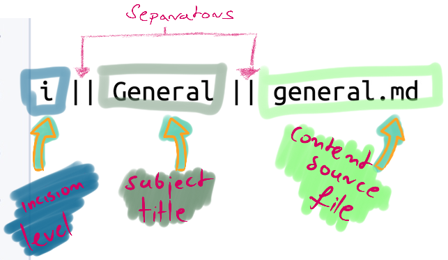

[](/LICENSE)
[](https://developer.apple.com/swift)
[](https://twitter.com/Roherdzik)

# SkrybaMD 📝
Simple markdown documentation generator, never again -> git conflicts among the team members which are updating documentation at the same time 💥

# Motivation to create SkrybaMD

# How it works? 


## Features
- automatic subject enumeration
- separation of content by using different source .md file for each Section. In this way there will be very small probability to have merge conflicts in the team
- multiple intent, you can define easily structure which will support e.g. 1.1.1.3 subject intent

# Usage

1. **Define shape of your documentation**

To do so, you need to create your own `doc_shape.txt` (see and play with Example folder).

Follow convention explained below:


_`doc_shape.txt` example:_

```
i || General || general.md
i || Architecture || architecture_config.md
ii || Our Approach || our_approach.md
i || CI and Rest || ci_and_rest.md
i || Summary || summary.md
```

2. **Create files content for each subject**

Create source .md file for each Subject in the same directory as `doc_shape.txt`.
In the shape example which we see above, it will be e.g. file with the `general.md` name for "General" subject. Base on mentioned `general.md` file, script will create documentation body.

3. **Run Script**

Run script using terminal in the directory of previously defined files (`doc_shape.txt` and content subjects .md files). 

`>> SkrybaMD MySuperDocumentation`  - if you have installed SkrybaMD globally 🌍

or

`>> ./SkrybaMD MySuperDocumentation` - if you have SkrybaMD script in the current directory 🏠

You will find markdown generated `MySuperDocumentation.md` file in the same directory 💥

ENJOY 🙌

_NOTE: you can play around with script using "Example" folder from this repository_

# Installation
`// _TODO [🌶]:`


# TODO
- [x] create script installation logic (now script need to be build from xcode and copy/paste in the place where source files are located)
- [x] handle as a input of the script name of the Output file
- [ ] create redable README.md file, with installation, how to use, ect...
- [ ] clean up code, move to separate files, change into classes/structures
- [x] create .md anchors from table of content to particular documentation place (see: https://gist.github.com/asabaylus/3071099#file-gistfile1-md)
- [ ] Handle special characters in the Table of Content titles like e.g.: `, ~ ... now probably some of them will break linking mechanism
- [ ] Add "Do not edit directly .md file" footer
- [ ] Unit Tests
- [ ] Move Todo to separate .md file
